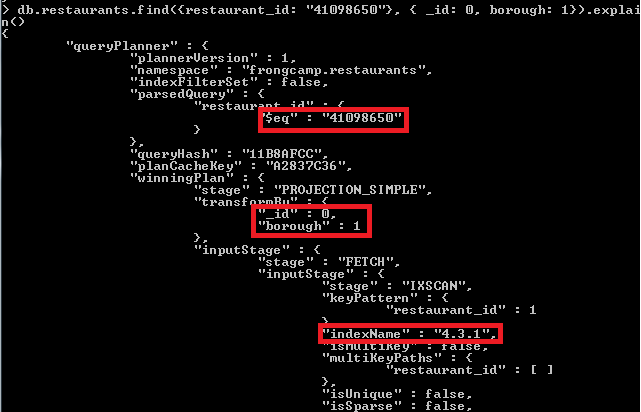
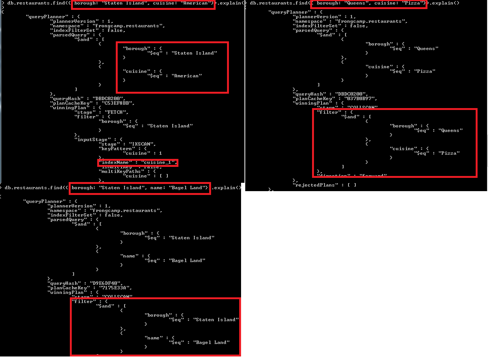
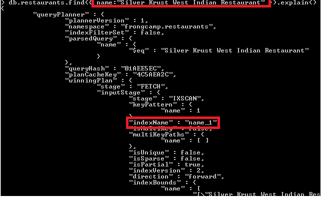

```
mongoimport --db frontcamp --collection restaurants --file C:/data/db/restaurants.json
```

# task 3:

1) RESULT: 728
---------------

```
{ borough: "Queens", cuisine: "Chinese"}
```

2) RESULT: 5dc468ae4c745d010cdeb463 "restaurant_id": "40372466"
---------------

```
$project {
  _id: "$_id",
  maxScore: {$max: "$grades.score"}
} + $sort {
  maxScore: -1
}
```

3) Done
---------------
```
{ borough: "Manhattan"}, { $set: { "grades": { grade : "A", score: 7, date: ISODate() }}}
```

4) RESULT: name:"Silver Krust West Indian Restaurant"
---------------

```
filter:{ "grades.8.score": {$lt: 7}} + project: {name: 1}
```

5) RESULT: { _id: "5dc468af4c745d010cdee854" ,borough: "Bronx"}
---------------

```
{ cuisine: "Seafood", "grades.grade": "B", "grades.date": {$gte: ISODate("2014-02-01T00:00:00.000Z"), $lt: ISODate("2014-03-01T00:00:00.000Z")}}
```
***

# task 4:

1) 
---------------

2) db.restaurants.dropIndex("name")
---------------

3) 
---------------

```
{restaurant_id: "41098650"}, { _id: 0, borough: 1}
db.products.createIndex(
  {restaurant_id: 1}, { _id: 0, borough: 1},
  { name: "4.3.1" }
)
```
4) 
---------------

```
{ borough: "Staten Island", cuisine: "American"}
{ borough: "Staten Island", name: "Bagel Land"}
{ borough: "Queens", cuisine: "Pizza"}
```
```
db.restaurants.createIndex(
   { cuisine: 1 },
   { partialFilterExpression: { borough: { $eq: "Staten Island" } } }
)
```

5) 
---------------

```
db.restaurants.createIndex(
   { name: 1 },
   { partialFilterExpression: { name: { $eq: "Silver Krust West Indian Restaurant" } } }
)
```
```
{ name:"Silver Krust West Indian Restaurant" }
```
***
