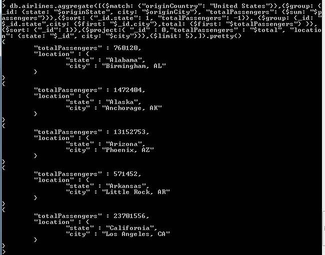

```
mongoimport.exe -d frontcamp -c airlines --type csv --headerline --file C:/data/db/airlines.csv
```

# task 1:
---------------

1) 
```
db.airlines.aggregate([{$group: {_id: "$class", total: {$sum: 1}}}])
```

2) 
```
db.airlines.aggregate([{$group: {_id: "$destCity", avgPassengers: {$avg: "$
passengers"}}},{$project:{ "avgPassengers" : "$avgPassengers", "city": "$destCit
y"}},{$sort: {"avgPassengers": -1}}, {$limit: 3}])
```

3) 
```
db.airlines.aggregate([{$match: {"destCountry": "Latvia"}},{$group: {_id: "$destCountry", carriers: {$push: "$carrier"}}}])
```

4) 
```
db.airlines.aggregate([{$match: {"originCountry": "United States", "destCountry": {$in: ["Greece","Italy","Spain"]}}},{$sort: {"passengers": -1}},{$limit: 10},{$skip: 3},{$project:{ "_id" : "$carrier", "total": {$sum: "$passengers"}}}])
```

5) 
```
db.airlines.aggregate([{$match: {"originCountry": "United States"}},{$group: {_id: {state: "$originState", city: "$originCity"}, "totalPassengers": {$sum: "$passengers"}}},{$sort: {"_id.state": 1, "totalPassengers": -1}}, {$group: {_id: "$_id.state",city: {$first: "$_id.city"},total: {$first: "$totalPassengers"}
}}, {$sort: {"_id": 1}},{$project:{ "_id" : 0,"totalPassengers" : "$total", "location": {state: "$_id", city: "$city"}}},{$limit: 5},]).pretty()
```


# task 2:
---------------

1) 
```
mongorestore -d frontcamp -c enron  C:\data\db\enron\messages.bson
```

2) 

```
db.enron.aggregate([{$addFields:{'headers.ToUnique': {'$setUnion': ['$headers.To', []]}}}, {$unwind: {path: "$headers.ToUnique"}},{$group: {_id: {from: "$headers.From", to: "$headers.ToUnique"}, count : { $sum: 1}}}, {$sort: {"count": -1}},{$limit: 1}]).pretty()
```

***
